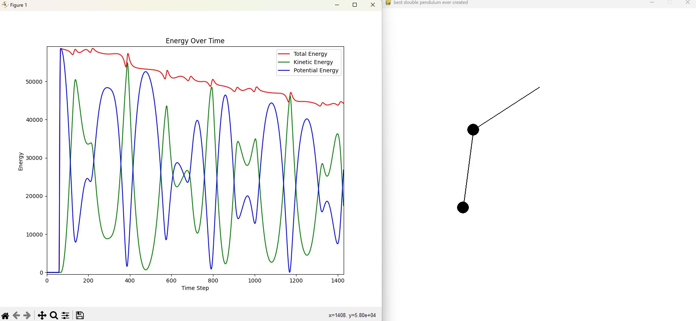

**how to use** 
first, make sure you have python 3 installed

also, make sure you have pygame installed (pip install pygame) and matplotlib (pip install matplotlib)
then just press run and it should work fine. just click on a bob and drag it however you like to start the sim!

it should look like the following.

**the code** 
if the code is confusing lmk and ill help, or you can always ask your favorite llm lol.

delta_t here is a big focus on what causes numerical instability btw. 

here we are trying to avoid artificial energy drift through numerical instability. eulers is very unstable over time, especially with more complex systems like a dp. if you take a look at pendulum, it actually does quite well to approximate, compare that to the dp, and HUGE difference.